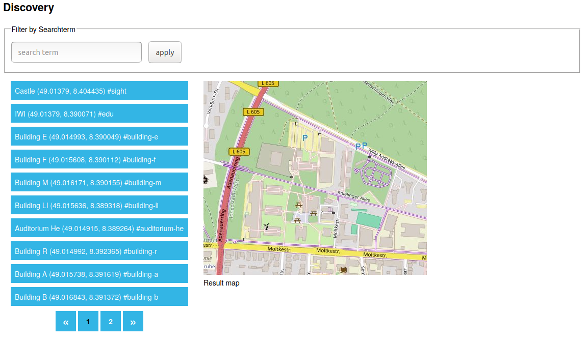

# 4. Aufgabe - Interaktion per REST und AJAX

Die vierte Aufgabe hat folgende Ziele:

1. Aufrufe aus dem Browser sollen mittels **AJAX** erfolgen (statt Formularen).
2. Auf der Serverseite soll dazu eine **REST-API** realisiert werden.
3. Optional soll die GeoTag Suche durch **Pagination** der Ergebnisliste erweitert werden.

Grundsätzlich soll die Funktionalität der Anwendung identisch erhalten bleiben, nur dass die Interaktion mit dem Server per AJAX wesentlich schneller und ohne störenden Aufbau einer neuen Seite abläuft. Die Seitennummerierung der GeoTag Liste ermöglicht den Umgang mit umfangreichen Ergebnismengen.

Die Aufgabe vertieft die asynchrone Programmierung mit **Event-Listener** und **Promises** sowie die Verwendung der **Fetch API** in Javascript. Zudem wird die **Struktur von REST APIs** sowie deren Umsetzung mit dem **HTTP-Protokoll** über **Express Routen** in Javascript eingeübt.

## 4.1. Vorbereitung

### 4.1.1 Vorherige Lösungen übernehmen

Grundsätzlich benötigen sie als Ausgangspunkt für Aufgabe 4 eine Kopie der Lösung von Aufgabe 3. Die allgemeinen Teile des Systems sind schon im Ordner von Aufgabe 4 enthalten. Sie müssen nun noch die individuellen Teile ihrer Lösung kopieren. Gehen sie wie folgt vor:

1. Kopieren Sie das Stylesheet `Aufgabe1/gta_v1/public/stylesheets/style.css` aus Aufgabe 1 nach `Aufgabe4/gta_v4/public/stylesheets/style.css`.
2. Kopieren Sie die Client Skripte aus Aufgabe 3 `Aufgabe3/gta_v3/` nach `Aufgabe4/gta_v4/`.
   - Alle Skripte aus `./public/javascripts/`
3. Kopieren Sie die Serverskripte aus Aufgabe 3 `Aufgabe3/gta_v3/` nach `Aufgabe4/gta_v4/`.
   - `./app.js`
   - Alle Skripte aus `./models`
   - Das Template `Aufgabe4/gta_v4/routes/index.js` enthält Kommentare mit Hinweisen zur Erweiterungen der Routen für eine REST API. Führen sie dies mit ihrer Router-Implementierung aus `Aufgabe3/gta_v3/routes/index.js` zusammen.
4. Kopieren Sie die Datei `Aufgabe3/gta_v3/package.json` aus Aufgabe 3 nach `Aufgabe4/gta_v4/package.json`.
5. Kopieren Sie das EJS-Template `Aufgabe3/gta_v3/views/index.ejs` aus Aufgabe 3 nach `Aufgabe4/gta_v4/views/index.ejs`.

### 4.1.2 Node-js vorbereiten

1. Führen sie `npm install` im Verzeichnis `Aufgabe4/gta_v4/` aus, um die nötigen Module zu laden und zu installieren.
2. Um die App später zu starten führen sie `npm start` im Verzeichnis `Aufgabe4/gta_v4/` aus und öffnen sie [http://localhost:3000](http://localhost:3000) im **Browser**.

## 4.2. Teilaufgaben

Die Umstellung auf AJAX-Aufrufe und REST Schnittstelle betrifft Client- und Serverseite.

### 4.2.1 Serverseite (Node.js)

Für die REST-Schnittstelle auf der Serverseite kann das Skript `./routers/index.js` weiterentwickelt werden. Hier müssen neue Routen für die AJAX-Aufrufe erstellt werden. Details zu den REST Endpunkten finden sie in der Dokumentation des Templates. Möglicherweise müssen Sie auch die Klasse `InMemoryGeoTagStore` aus der Datei `./models/geotag-store.js` erweitern, um eindeutige Keys (Primärschlüssel) für GeoTags zu unterstützen.

#### Neue Routen der REST Schnittstelle

`tl;dr` Erstellen Sie eine komplette REST-API für GeoTags. Realisieren Sie zwei Routen zum Anlegen neuer Ressourcen und zur Suche auf einer Container Ressource mit URI `/api/geotags/` sowie drei Routen für das Lesen, Ändern und Löschen einzelner Ressourcen mit URI `/api/geotags/<id>`. Demonstrieren Sie alle Routen mit einem generischen REST-Client.

In einer *REST-konformen API* besitzen Ressourcen eines Typs (also z.B. GeoTag) eine *Container-Ressource*, die im URI-Pfad nach dem Plural der Ressource benannt ist (also z.B. `/api/geotags`). Das Erzeugen einer neuen Ressourcen-Instanz erfolgt dann per HTTP-Operation `POST` auf die Adresse der Container Ressource, wobei eine Beschreibung der neuen Ressource als JSON gesendet wird. Das Auslesen aller Ressourcen-Instanzen als JSON Liste erfolgt durch HTTP-Operation `GET` auf die Adresse der Container Ressource. Durch Übergabe eines Filters (z.B. Suchbegriff oder Radius) als URL-Parameter kann eine Suche repräsentiert werden. Realisieren sie zwei entsprechende Routen.

Einzelne Ressourcen-Instanzen sind in einer REST-API über eine individuelle URI direkt zugreifbar. Diese Adresse folgt meist dem Schema `<Container-Ressource>/<Ressourcen-ID>` (also z.B. `/api/geotags/123`). Beim Erzeugen einer neuen Ressourcen-Instanz per `POST` sollte am Ende deren URI im `Location` HTTP-Header zurückgesendet werden. Der HTTP Response Code ist `201` (Created).

In einer REST-API können einzelne Ressourcen-Instanzen über ihre individuelle URI gelesen, geändert oder gelöscht werden. Dazu werden die HTTP Operationen `GET`, `PUT` und `DELETE` verwendet. `GET` liefert die einzelne Ressource als JSON zurück, mit `PUT` wird eine Beschreibung der geänderten Ressource mitgeschickt und bei `DELETE` werden keine Ressourcenbeschreibungen ausgetauscht. Realisieren sie drei entsprechende Routen im Server.

Für das Testen der REST API stehen generische Clients zur Verfügung. Damit können beliebige HTTP Aufrufe spezifiziert und durchgeführt werden. Solche Clients sind in den meisten IDEs, als Browser Plugins oder eigenständige Tools verfügbar. Beliebte Beispiele sind:

- **curl** für Konsole/Terminal [https://curl.haxx.se](https://curl.haxx.se)
- **REST Client** für Visual Studio Code [https://marketplace.visualstudio.com](https://marketplace.visualstudio.com/items?itemName=humao.rest-client)

Demonstrieren sie alle Routen Ihrer REST API mit einem REST Client Ihrer Wahl. Zeigen sie dazu den Lebenszyklus eines GeoTags (Erstellen, Auslesen, Ändern, Suchen, Löschen).

#### Tipps zur Verarbeitung von JSON im Express Server

Die Vorverarbeitung des HTTP-Requests erfolgt mit einer in Express enthaltenen Middleware, die mit `express.json()` bereitgestellt wird (zu sehen in `./app.js`). Der Request muss den Header `Content-Type: application/json` enthalten. Der JSON-Inhalt lässt sich dann aus dem [Body des Request Objekts](http://expressjs.com/de/4x/api.html#req.body) entnehmen.

### 4.2.2 Clientseite (Browser)

Für den AJAX Aufruf im Browser müssen sie ihr Javascript `Aufgabe4/gta_v4/public/javascripts/geotagging.js` weiter anpassen.

#### Auswertung der Formulare ändern

Die Formulare für die Eingabe und das Filtern von Tags können grundsätzlich beibehalten werden, jedoch soll jeweils beim Klicken des Buttons ein AJAX-Aufruf erfolgen. Hierzu müssen Sie beim Laden der Seite Event-Listener erstellen und registrieren. Dies sollte direkt nach dem Laden einer Seite erfolgen. Daneben muss noch das standardmäßige Absenden der Formulare verhindert werden. Eine Möglichkeit hierzu wurde in der Vorlesung gezeigt. Achten sie darauf, dass die Validierung der Formulareingaben (aus Aufgabe 1) erhalten bleibt.

#### AJAX-Aufrufe hinzufügen

Der AJAX-Aufruf soll mit der **Fetch API** realisiert werden (siehe entsprechende Folien). Verwenden sie bitte kein JQuery und auch nicht `XMLHttpRequest`.

- Für das **Tagging Formular** soll der Aufruf *asynchron* ablaufen und die Daten per *HTTP POST* in *JSON Format* an den Server senden.
  - Tipp 1: Sie können hier den serverseitigen *GeoTag Konstruktor* aus Aufgabe 3
    im Client Skript wiederverwenden.
  - Tipp 2: spezifizieren sie einen geeigneten *MIME-Type* für JSON im
    HTTP-Header `Content-Type`, damit der Server den Inhalt erkennt.
- Für das **Discovery Formular** soll der Aufruf auch *asynchron* ablaufen aber per *HTTP GET* mit *Query Parametern* erfolgen.

#### Weitere Funktionen

Auf der Clientseite muss noch eine Funktion zur Aktualisierung der Darstellung im Discovery-Widget erstellt werden. Diese soll die Ergebnisliste und die Karte aktualisieren. Die Aktualisierung soll sowohl beim Anlegen eines neuen Filters als auch eines neuen GeoTags erfolgen.

## 4.3. Zusatzaufgabe

Die Zusatzaufgabe besteht darin, die vorhandene Ergebnisliste für GeoTags im Discovery Widget mit einer Funktion für die Seitennummerierung ([Pagination](https://en.wikipedia.org/wiki/Pagination)) zu ergänzen. Längere Ergebnislisten sollen auf mehrere nummerierte Seiten aufgeteilt werden, zwischen denen über Links gewechselt werden kann.

Ein Beispiel wie dies aussehen könnte, zeigt die folgende Abbildung:

Wie die Seitennummerierung gestaltet wird, ist ihnen überlassen.

### 4.3.1. Teilschritte

Die Umsetzung der Aufgabe könnte nach folgender Methode erfolgen:

1. Überlegen Sie, wie sich die nummerierte Liste verhalten soll, wie sie dargestellt wird und wie die Bedienung erfolgt. Legen Sie auch Details fest, wie z.B. die Anzahl der Einträge pro Seite.
2. Planen Sie die nötigen Änderungen der aktuellen GeoTagging App für die Umsetzung der nummerierten Liste im Client und im Server.
3. Erstellen Sie die neue Seitenstruktur (HTML).
4. Gestalten Sie die Strukturelemente der Seitennummerierung (CSS).
5. Führen Sie die nötigen Änderungen an den HTTP-Endpunkten durch (Server).
6. Koppeln Sie das Client Script mit den geänderten Endpunkten (Client).

### 4.3.2. Anforderungen

Bei der Erstellung soll darauf geachtet werden, dass nur die GeoTags für die aktuell benötigte Seite geladen werden. Es sollen also **nicht** alle GeoTags angefragt, aber nur die aktuell sichtbaren (z.B. 10) angezeigt werden!

Ist man (wie in obiger Abbildung) auf der ersten Seite und möchte per Pfeil nach links eine Seite zurück blättern, dann soll nichts geschehen. Dasselbe gilt für die letzte Seite mit Pfeil nach rechts.

## Checkliste

Zur Übersicht folgen noch mal alle Anforderungen in kompakter Form als Checkliste.

### 1. Teilaufgabe: Server-Erweiterung

- [ ] Neue **Routen** realisieren (`./routers/index.js`)
  - [ ] GET `/api/geotags`
  - [ ] POST `/api/geotags`
  - [ ] GET `/api/geotags/:id`
  - [ ] PUT `/api/geotags/:id`
  - [ ] DELETE `/api/geotags/:id`
- [ ] **Servermodule erweitern**
  - [ ] Klasse `InMemoryGeoTagStore` mit Primärschlüsseln für GeoTags
- [ ] Backend **Demonstrator** mit **generischem HTTP-Client**
  - [ ]  **Lebenszyklus** für GeoTag vorführen: Erstellen, Auslesen, Ändern, Suchen, Löschen

### 2. Teilaufgabe: Client-Erweiterung

- [ ] **Formularauswertung** ändern
  - [ ] **Event-Listener** für beide Formulare registrieren
  - [ ] **Absenden** der Formulare verhindern
  - [ ] **Formular-Validierung** bleibt erhalten
- [ ] **AJAX-Aufrufe** per **Fetch API** hinzufügen
  - [ ] Aufruf im **Tagging Formular** *asynchron*
    - [ ] *HTTP POST* mit Body in *JSON Format*
  - [ ] Aufruf im **Discovery Formular** *asynchron*
    - [ ] *HTTP GET* mit *Query Parametern* 
- [ ] **Anzeigeaktualisierung** realisieren
  - [ ] **Ergebnisliste** aktualisieren
  - [ ] **Karte** aktualisieren

### Zusatzaufgabe: Pagination

- [ ] **HTTP-Endpunkte** (Routen) im Server mit Paging-Unterstützung
  - [ ] Abfrage von Seiten/Bereichen der Ergebnisliste
  - [ ] Demonstration mit generischem HTTP Client
- [ ] **Paging-Ergebnisliste** im Client
  - [ ] Anfangs erscheinen alle GeoTags (in der Nähe) als Seitenmenge
  - [ ] Paging Widget im Client unter Ergebnisliste
    - [ ] Vor- und Zurückblättern von Seiten
    - [ ] Kein Blättern vor/nach der ersten/letzten Seite
  - [ ] Discovery und Tagging Formulare ändern Seitenmenge
  - [ ] Client lädt immer nur eine Seite vom Server
