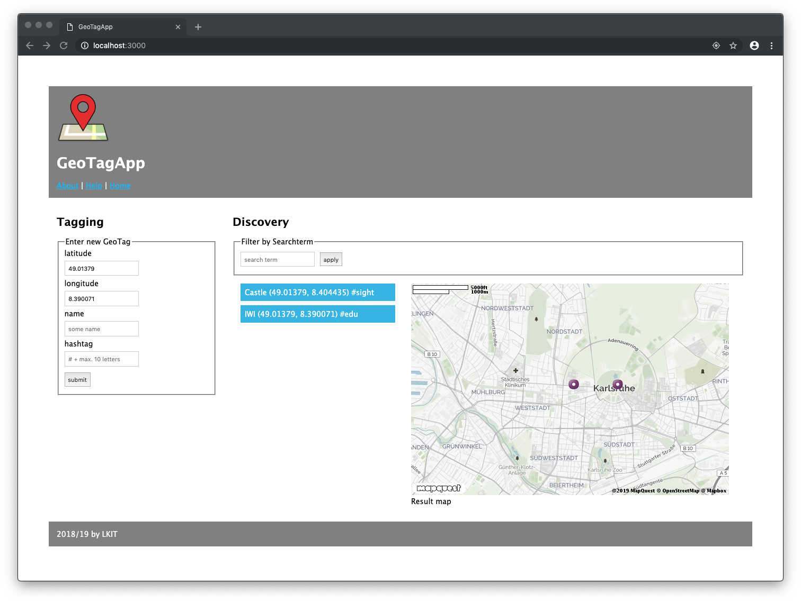

# VS1lab - Laborübungen Verteilte Systeme 1

Ziel des Labors ist die praktische Anwendung verschiedener Web Technologien aus der Vorlesung. Dazu wird in mehreren Schritten eine komplette Web Anwendung erstellt. In jedem Schritt wird jeweils ein Bereich von Web Technologien genauer betrachtet.

## Die Geo Tagging App (GTA)

In der Übung entwickeln wir die **Geo Tagging App** (kurz GT-App oder GTA): eine [Social Sharing App](https://de.wikipedia.org/wiki/Media_Sharing) für interessante Orte. Die App verwaltet **GeoTags** (= Locations mit [Hashtags](https://de.wikipedia.org/wiki/Hashtag)). Dies beinhaltet zwei Hauptaktivitäten: das Anlegen (*Tagging*) und die Suche (*Discovery*) von GeoTags, die wie folgt umgesetzt werden:

- Über ein *Tagging [Widget](https://de.wikipedia.org/wiki/Widget)* (als Formular realisiert) kann jederzeit der Name sowie ein Hashtag für den aktuellen Ort des Browsers (mit automatisch erfassten Koordinaten) registriert werden.

- In einer *Discovery Liste* werden die GeoTags der aktuellen Umgebung angezeigt. GeoTags der Umgebung können zudem über Name oder Hashtag gefiltert werden.

## Entwicklungsumgebung

Auf einem Entwicklungsrechner brauchen sie zur Lösung der Aufgaben verschiedene [Tools](https://de.wikipedia.org/wiki/Programmierwerkzeug) und [Frameworks](https://de.wikipedia.org/wiki/Framework). Für die ersten zwei Aufgaben sind folgende Komponenten nötig:

- Eine **[Java Script IDE](https://en.wikipedia.org/wiki/Comparison_of_integrated_development_environments#JavaScript)** oder ein **[Code Editor](https://en.wikipedia.org/wiki/Source_code_editor)** (z.B. [Visual Studio Code](https://code.visualstudio.com), [WebStorm](https://www.jetbrains.com/webstorm/), [Atom](https://atom.io) etc.).
  - Wir empfehlen aktuell [Visual Studio Code](https://code.visualstudio.com)
    - Microsoft beschreibt Grundlagen zu [JavaScript in VS Code](https://code.visualstudio.com/docs/languages/javascript)
    - Die Erweiterung [Live Server](https://marketplace.visualstudio.com/items?itemName=ritwickdey.LiveServer) ist sehr nützlich zur Entwicklung von HTML, CSS und clientseitigem JavaScript  
    - Für die Server-Entwicklung mit Node.js in VS Code empfehlen wir die Erweiterung [Remote Containers](https://marketplace.visualstudio.com/items?itemName=ms-vscode-remote.remote-containers)
- Ein **[Web Browser](https://en.wikipedia.org/wiki/Source_code_editor)** (nach Belieben [Chrome](https://en.wikipedia.org/wiki/Google_Chrome), [Firefox](https://en.wikipedia.org/wiki/Firefox), [Safari](https://en.wikipedia.org/wiki/Safari_(web_browser)), [Edge](https://en.wikipedia.org/wiki/Microsoft_Edge) etc.)
- Möglichst [**git**](https://git-scm.com) als **[Version Control System](https://de.wikipedia.org/wiki/Versionsverwaltung)** (VCS)

Ab der dritten Aufgabe kommen folgende Frameworks hinzu:

- [**Node.js Plattform**](https://nodejs.org) (inkl. npm)
- [**Express Framework**](http://expressjs.com) (inkl. Express-Generator)

Alle Komponenten sind auf den Poolrechnern (LI 137) vorhanden. Sie können aber auch leicht selbst auf dem eigenen Rechner installiert werden. Alle Werkzeuge sind natürlich kostenfrei erhältlich.

## Aufgaben

Die Laborübungen umfassen vier Teilaufgaben:

1. [Web Apps strukturieren (HTML5) und gestalten (CSS3)](Aufgabe1)
2. [Clientseitige Programmierung mit JavaScript / HTML5-APIs](Aufgabe2)
3. [Serverseitige Anwendung mit Node.js / Express / EJS erstellen](Aufgabe3)
4. [Interaktion per REST-API und AJAX-Aufrufen](Aufgabe4)

## Beispiele

Für einige weitere Vorlesungsthemen gibt es [praktische Code-Beispiele](Beispiele).
